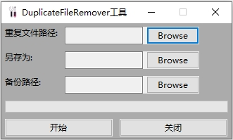

# FileToolKit
一系列经常用的的文件小工具包，目前暂时仅包含了 DuplicateFileRemover 工具  
  
## DuplicateFileRemover  
一个删除重复文件的小工具，有着非常简洁的窗口界面，它会自动删除指定文件夹下面的重复文件，并将所有不重复的文件移动到用户指定的文件中，同时为了避免出现意外，它会自动在指定的文件夹中先进行备份操作。  

## 为什么要开发它  
因为C++实在是太酷了，我喜欢用C++完成各种事情，虽然我知道有很多简单的东西可以用Python等脚本很轻松的完成 :)  
此外我居然发现像 DuplicateFileRemover 这种简单的删除重复文件的功能居然还有收费软件，原来这也能赚钱的吗？？真不可思议~  

  
## 编译  
目前仅支持windows x64，所以直接用VS打开编译就行了。VS版本要求在2019以上。x86 理论上也可以，但是我没有配置对应的编译选项。
  
## 第三方依赖  
- [wxWidget](https://www.wxwidgets.org/) v3.2.2.1  
- [wxFormBuilder](https://github.com/wxFormBuilder/wxFormBuilder) 用于打开.fbp文件  
  
vs需要依赖几个宏。这些宏用于指定第三方库和头文件的路径：
- WX_WIDGETS_INCLUDE  wxWidget头文件的包含路径。它应该包含两个具体的目录，例如：  
C:\wxWidgets-3.2.2.1\include  
C:\wxWidgets-3.2.2.1\include\msvc  
  
## DuplicateFileRemover 使用方法  
  
如上图所示，这是主界面，选择三个目录即可开始工作了。第一个目录是重复文件的保存目录。第二个目录是去重之后文件保存的位置，第三个是备份的路径，工作之前会进行备份避免数据丢失。点击开始就可以了。。